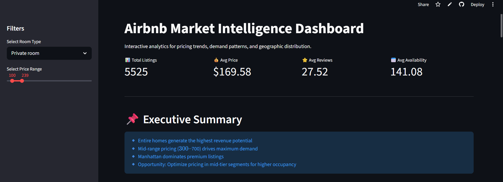

# 🏡 Airbnb Market Intelligence Dashboard

## 📊 Overview

The **Airbnb Market Intelligence Dashboard** is an interactive analytics platform designed to uncover **pricing trends, demand patterns, and market opportunities** in Airbnb listings.

Built using **Python, Pandas, Plotly, and Streamlit**, this project transforms raw data into **actionable business insights**, simulating real-world data analyst workflows.

---

## 🌐 Live Dashboard

👉 https://airbnb-market-intelligence-dashboard-ef5b6zdev4kqpjaxuahnqy.streamlit.app/

---

## 🎯 Business Problem

Airbnb hosts and investors need to:

* Identify optimal pricing strategies
* Understand demand behavior
* Analyze competition across neighborhoods

This dashboard solves these by providing **data-driven insights for better decision-making**.

---

## 🚀 Key Features

### 🔍 Interactive Filtering

* Filter by **room type**
* Adjust **price range dynamically**

### 💰 Revenue Analysis

* Price distribution using box plots
* Average pricing across neighborhoods
* Identify high-revenue segments

### 📈 Demand Insights

* Relationship between **reviews and pricing**
* Identify high-demand price ranges

### 🏙 Supply Analysis

* Distribution of listings across neighborhoods
* Detect market saturation

### 🌍 Geographic Intelligence

* Interactive map of listings
* Price-based spatial visualization

---

## 📊 Key Insights

* Entire homes generate **higher revenue potential** than private rooms
* Mid-range pricing ($300–$700) drives **maximum demand**
* Manhattan and Brooklyn dominate **market supply**
* Several neighborhoods show **high demand at moderate pricing**

---

## 🚀 Strategic Recommendations

* Optimize listings within **mid-price segments**
* Use **dynamic pricing strategies** in high-demand areas
* Focus on high-review neighborhoods for **consistent bookings**
* Differentiate listings in competitive markets

---

## 🛠 Tech Stack

* **Python**
* **Pandas**
* **Plotly**
* **Streamlit**

---

## 📁 Project Structure

```bash id="n2ov9l"
Airbnb_Project/
│── app.py
│── analysis.py
│── Airbnb_Open_Data.csv
│── requirements.txt
│── README.md
```

---

## ▶️ Run Locally

```bash id="t4y49y"
git clone https://github.com/pratyakshagupta16/Airbnb-Market-Intelligence-Dashboard.git
cd Airbnb_Project
pip install -r requirements.txt
streamlit run app.py
```

---

## 📸 Dashboard Preview

*


*

---

## 💡 Future Enhancements

* Price prediction using Machine Learning
* Real-time Airbnb data integration
* Advanced filtering (ratings, amenities)
* Recommendation system

---

## 👤 Author

**Pratyaksha Gupta**

---

## ⭐ Project Highlights

✔ End-to-end data analysis project
✔ Interactive dashboard with real-world insights
✔ Deployed application (production-ready)
✔ Business-focused analytics

---
